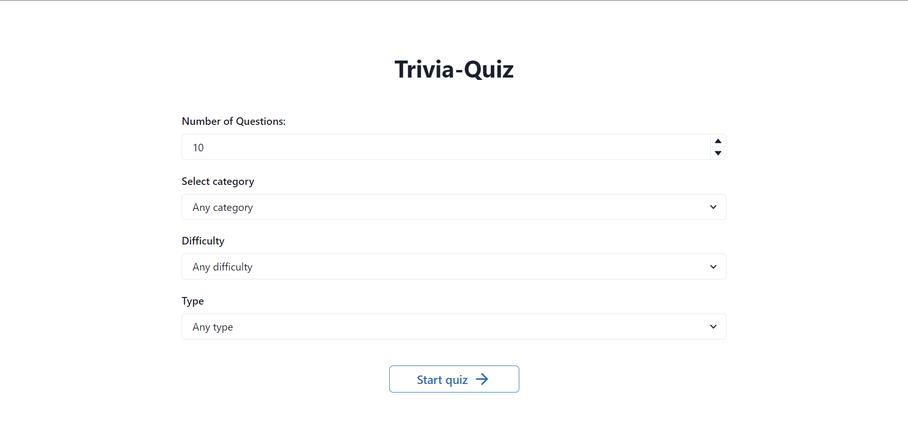
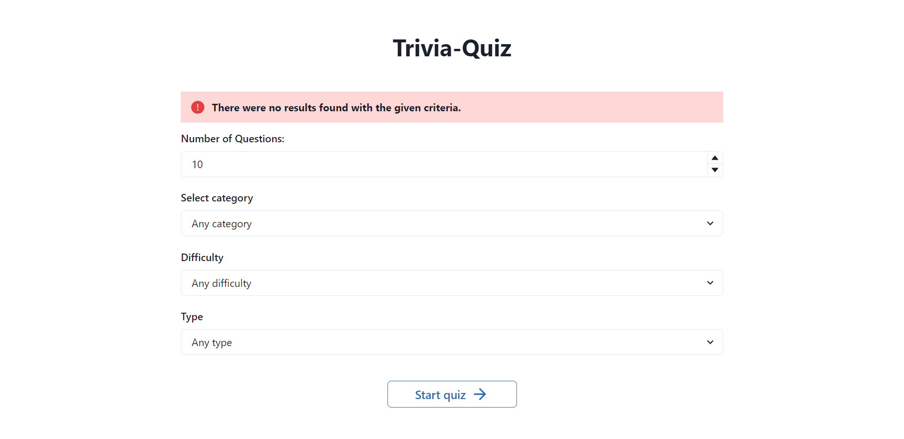
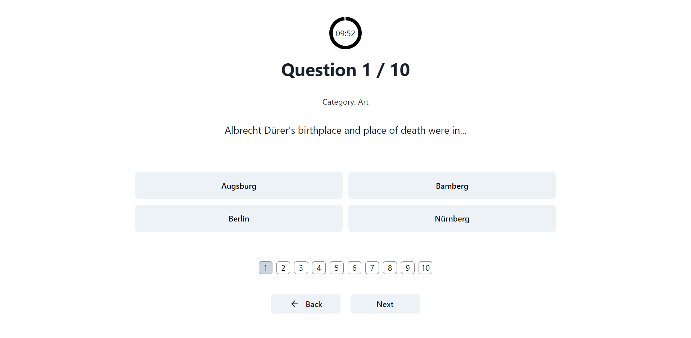
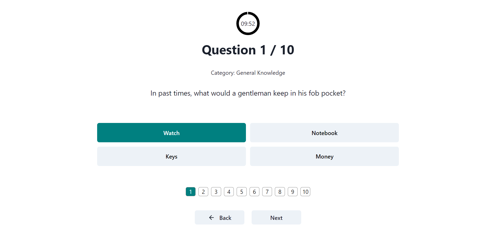
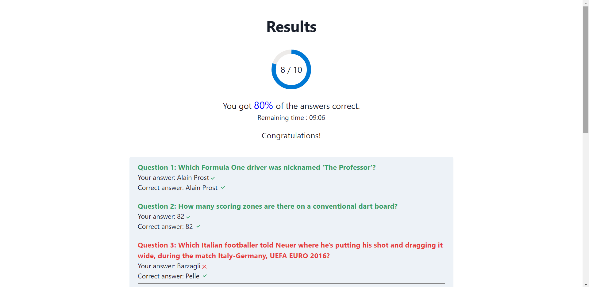

# Trivia-Quiz-App

This is a quiz app, you select your type of questions and answer them in a limited time frame - you have 1 minute per question.
- choose type of questions category.
- choose an answer type : true/false or multiple choice.
- opportunity to retry the same quiz when you finish.

# 💻Technologies

 - ReactJS
 - HTML
 - CSS
 - Chakra UI
 - Cypress for e2e tests

# 👀Screenshots

</img>
</img>
</img>
</img>
</img>
</img>

# 🏆Feedback 

Thank you for viewing my project. If you have any questions, just dm me.
